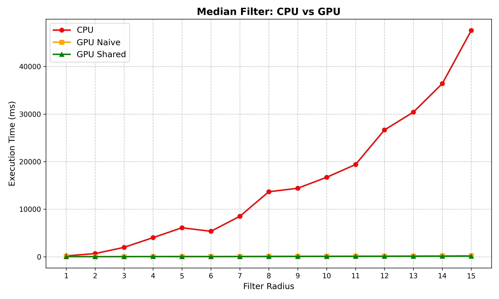
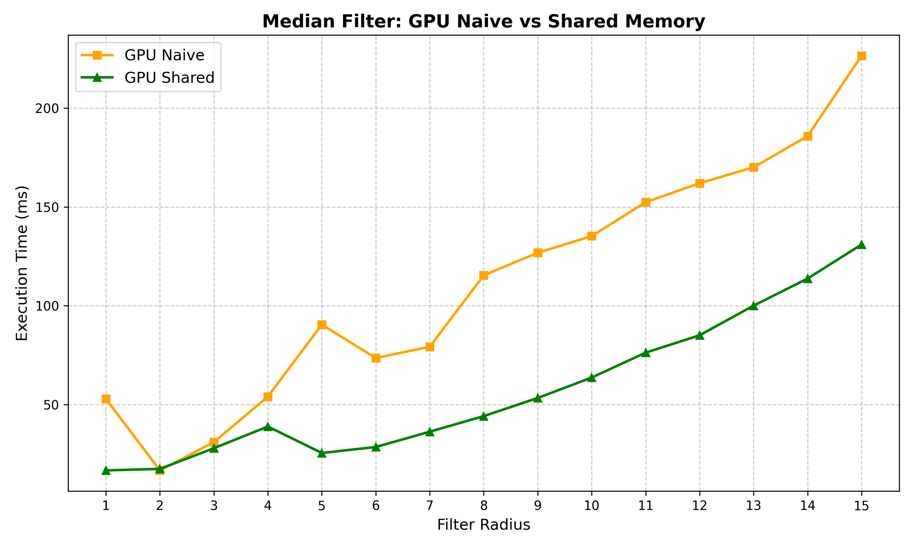
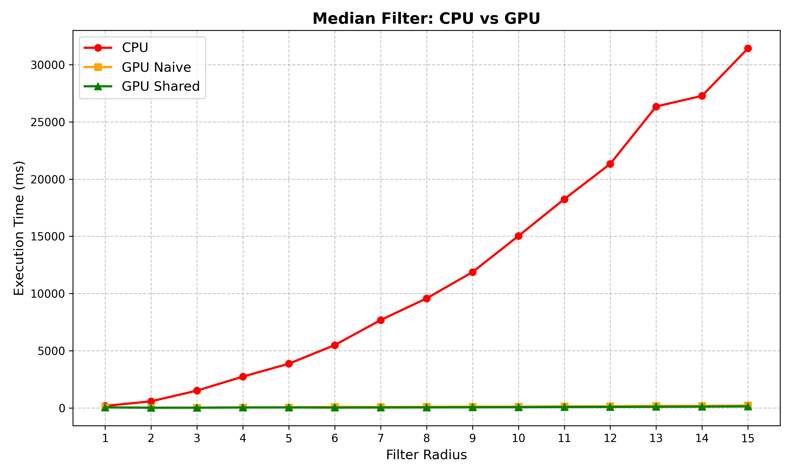
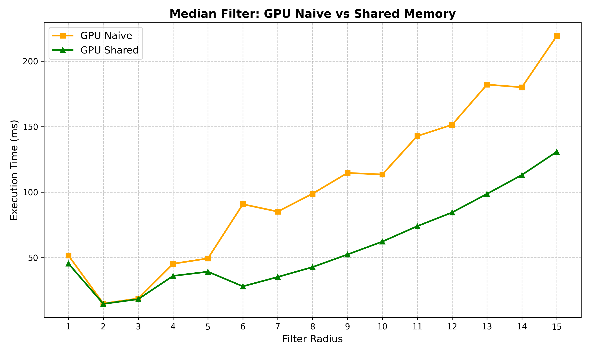
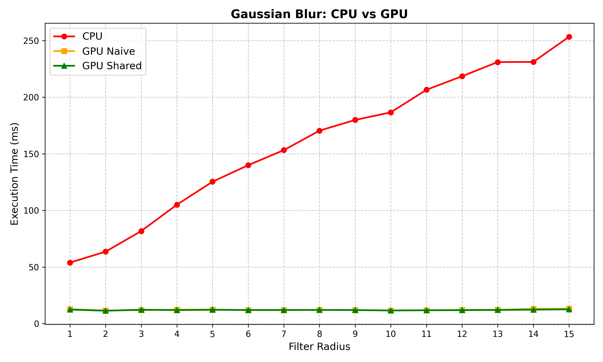
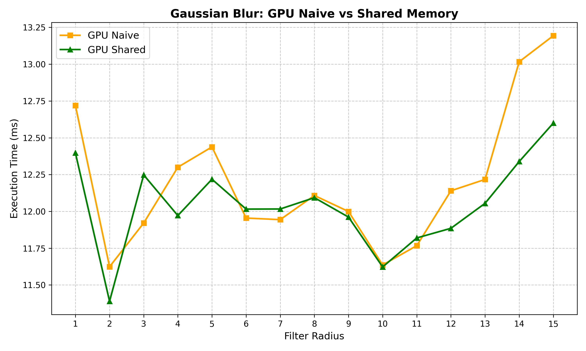

# GPU Accelerated Image Filtering
This repo is for a university course at ELTE. See: https://cv.inf.elte.hu/index.php/education/gpu-programozas/

## Recommended CMake command
`cmake .. -G "Visual Studio 17 2022" -A x64 -DCMAKE_TOOLCHAIN_FILE=C:/vcpkg/scripts/buildsystems/vcpkg.cmake`

Adjust generator as needed.

---

## Performance Analysis: GPU-Accelerated Image Filtering

Execution times measured with `std::chrono` on a 1024px wide image. Each radius tested once, results saved to CSV.

### Median Filter

#### Hybrid Median Algorithm

The `getMedianAuto` kernel dynamically switches between Bubble Sort (R < 4) and Histogram-based search (R ≥ 4) to attempt to maximize throughput across all radii.

##### CPU vs GPU (Hybrid)

The CPU time grows quadratically while both GPU variants stay well below 300 ms across all radii. Note the small spike at R=1 where the histogram path's overhead slightly penalises the very smallest windows:

The dynamic switching resulted in slightly lower performance overall compared to the dedicated histogram kernel. See the conclusion in the [Technical Documentation](#algorithmic-optimization-attempt-hybrid-median-search) section below.

#### CPU vs GPU Overview

The CPU execution time grows quadratically. At R=15 it reaches ~30 seconds while both GPU versions stay below 300ms. The difference between the two GPU implementations is invisible at this scale.

#### GPU Naive vs Shared Memory

At R=15, the Shared Memory version is roughly 1.5x faster than Naive.

### Gaussian Blur

#### CPU vs GPU Overview

The CPU Gaussian blur is also a separable 2-pass filter, so it scales linearly (O(N)) rather than quadratically. However, the sequential per-pixel computation still falls far behind the GPU at larger radii.

#### GPU Naive vs Shared Memory

Unlike the median filter, the Gaussian blur is a linear convolution operation. The Shared Memory version maintains an advantage through better memory access patterns via the 1D halo tiles. Although the high variance probably comes from `std::chrono`'s error.

---

## Technical Documentation: GPU-Accelerated Image Filtering

This document details the design considerations, algorithmic choices, and optimization strategies implemented in the OpenCL-based GPU image filtering pipeline, specifically focusing on the Median Filter.

### Algorithmic Optimization Attempt: Hybrid Median Search

Calculating the median requires finding the middle value of a local neighborhood. As the filter radius R increases, the window size grows quadratically: N = (2R+1)^2. We implemented a hybrid algorithmic approach (`getMedianAuto`) to attempt to maximize performance across different radii:

- **Bubble Sort (Radius < 4)**:
  For small windows (e.g., 3x3), the kernel uses a classic Bubble Sort. While its theoretical complexity is O(N^2), it is enough for small N and the worst case is N = 49, that is 49 * 48 / 2 = 1176 comparisons
  
- **Histogram-Based Search (Radius >= 4)**:
  For larger windows (up to R=15, i.e., 31x31 = 961 pixels), O(N^2) sorting becomes a bottleneck. The kernel dynamically switches to a Histogram-based median search, which operates in **O(N) time**. It builds a 256-bin frequency map of pixel intensities and linearly finds the median, entirely bypassing the need to sort the elements.

#### Conclusion

However the hybrid Median Search comes with overhead and all in all just embracing the histogram version results in better performance across all radii (except for r = 1, a small price)

### Memory Hierarchy: Shared Memory Optimization

A significant performance limitation for sliding-window filters is **Global Memory Bandwidth**.

- **The Naive Approach**: 
  In a naive implementation, every thread independently fetches N pixels from global memory. Because adjacent threads process highly overlapping neighborhoods, the exact same pixels are fetched repeatedly from the slow global VRAM, wasting bandwidth.
  
- **Cooperative Fetching (Tiling + Halo)**: 
  To resolve this, we implemented a **Shared Memory** strategy. A workgroup (e.g., 16x16 threads) is assigned a specific tile of the image. Before any computation begins, the threads work cooperatively to fetch the target tile **plus the required border pixels (halo)** into `__local` memory. 

- **Barrier Synchronization**: 
  A `barrier(CLK_LOCAL_MEM_FENCE)` ensures all threads have finished fetching the data before the computation phase begins. During the heavy processing phase, threads read their sliding windows exclusively from local memory.

### Boundary Handling (Clamping)

To handle pixels near the edges of the image (where the sliding window would read out of bounds), we utilized the OpenCL built-in `clamp()` function. 
- During the memory fetch phase, if a thread calculates an out-of-bounds global coordinate, it is clamped to the nearest valid edge pixel index.
- This ensures memory safety without relying on complex if/else branches. Eliminating branch divergence during the critical loops keeps the GPU wavefronts/warps synchronized.

### Separable Filtering (Gaussian Blur context)

While the median filter is a non-linear operation and cannot be mathematically separated, the project also implements Gaussian blur, which exploits **separable convolution**. 
Instead of a 2D convolution of O(N^2) complexity per pixel, the Gaussian blur is split into two 1D passes (Horizontal, then Vertical), reducing the complexity to O(2N). Paired with similar shared memory optimizations, this results in orders of magnitude faster execution compared to the naive 2D approach.

### Host-Side Architecture

The C++ host application (`main.cpp`) was designed as an interactive loop, where you can dynamically switch between different filters, toggling CPU usage, increase/decrease the radius and run benchmarks for the filter algorithms.