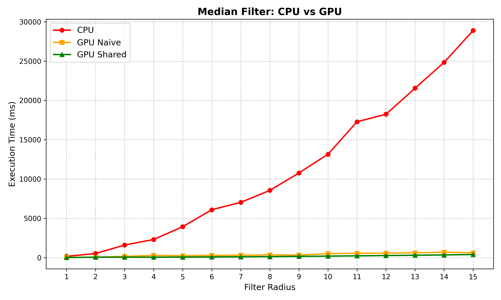
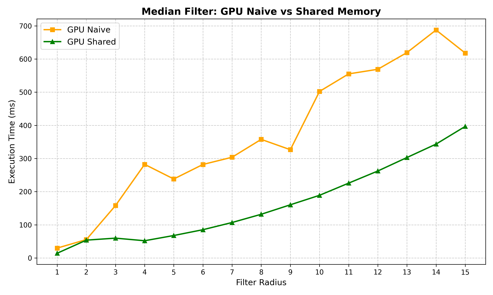
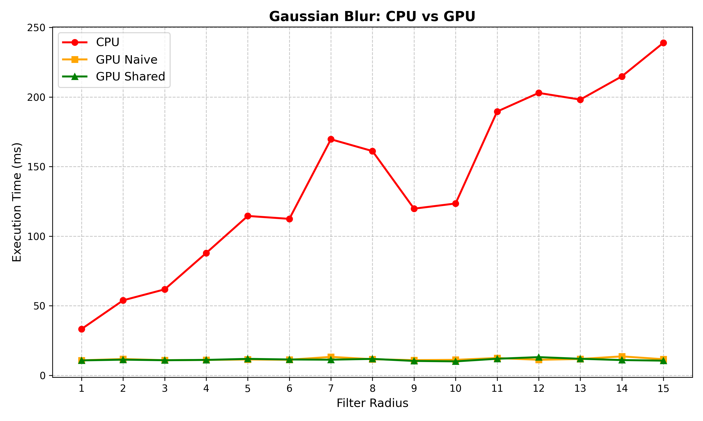
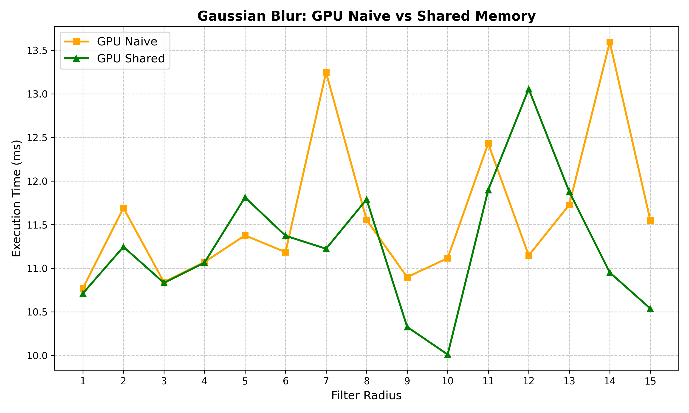

# Performance Analysis: GPU-Accelerated Image Filtering

Execution times measured with `std::chrono` on a 1024px wide image. Each radius tested once, results saved to CSV.

---

## Median Filter

### CPU vs GPU Overview

The CPU execution time grows quadratically — at R=15 it reaches ~30 seconds while both GPU versions stay below 700ms. The difference between the two GPU implementations is invisible at this scale.

### GPU Naive vs Shared Memory

At R=15, the Shared Memory version is roughly 1.5x faster than Naive.

### Observed Fluctuations in the Naive Implementation

The GPU Naive curve is not monotonically increasing. Two main causes:

**1. Algorithmic switch at R > 3**

The kernel uses a hybrid strategy via `getMedianAuto`:
- For R <= 3: Bubble Sort — fast for small windows (<=7x7) due to register efficiency
- For R > 3: Histogram search — O(N), much cheaper per pixel

This algorithmic discontinuity produces a non-linear jump in the execution time curve. The switch is visible in the Naive curve because global memory latency is the bottleneck and any compute change shows up directly.

**2. GPU L2 Cache Hit Rate Variance**

The Naive kernel reads every pixel of every sliding window directly from global memory. As the window size changes, the spatial access pattern shifts. At certain radii, accesses happen to align better with L2 cache burst sizes, producing seemingly random oscillations.

### Why the Shared Memory Curve is Smooth

The bottleneck is the cooperative tile fetch, not the per-pixel computation. The tile-loading cost scales predictably with radius, so the total execution time increases smoothly. The algorithmic switch still occurs but its impact is absorbed by the dominant memory fetch cost.

---

## Gaussian Blur

### CPU vs GPU Overview

The CPU Gaussian blur is also a separable 2-pass filter, so it scales linearly (O(N)) rather than quadratically. However, the sequential per-pixel computation still falls far behind the GPU at larger radii.

### GPU Naive vs Shared Memory

Unlike the median filter, the Gaussian blur is a linear convolution operation — no conditional algorithmic switching. The curves are therefore smoother. The Shared Memory version maintains an advantage through better memory access patterns via the 1D halo tiles.

---

## Summary Table

| Metric              | CPU Median  | GPU Naive Median | GPU Shared Median | CPU Gaussian | GPU Shared Gaussian |
|---------------------|-------------|------------------|-------------------|--------------|----------------------|
| Scaling             | O(N^2)/O(N) | O(N^2)/O(N)      | O(N^2)/O(N)       | O(N)         | O(N)                 |
| Memory Access       | Sequential  | Global Mem       | Local Mem         | Sequential   | Local Mem            |
| R=15 time (approx.) | ~30000 ms   | ~650 ms          | ~400 ms           | ~X ms        | ~Y ms                |
| Curve shape         | Exponential | Irregular        | Smooth            | Linear       | Smooth               |

*(Gaussian R=15 values to be filled in after running the `n` benchmark)*
